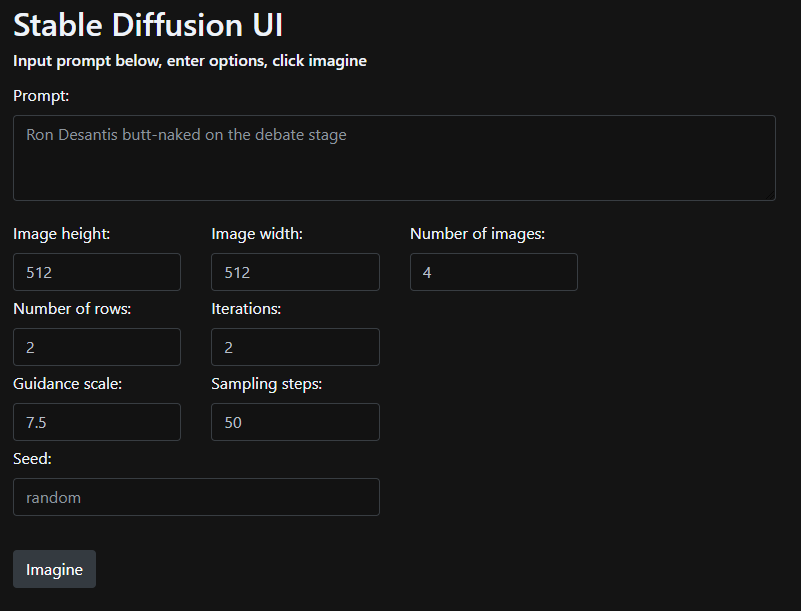

# Run guide

## Prerequisites
- `Python` >= 3.8
- [conda](https://docs.conda.io/en/latest/miniconda.html) (latest)
- [stable diffusion model](#stable-diffusion-model)
- Git CLI

## Quickstart
### Stable-diffusion-model
1. Go to [huggingface/stable-diffusion-v-1-4-original](https://huggingface.co/CompVis/stable-diffusion-v-1-4-original/tree/main)
2. Create or login to an existing account to access the repository
3. Download the 4GB `.cpkt` file
4. Create a new directory `app\models\ldm\stable-diffusion-v1`
5. Place the `.cpkt` file in this directory
6. Rename the file to `model.cpkt`

### Running the API
```shell
cd .\app\
conda env create -f environment.yaml
conda activate ldm2
python main.py
```

You should see some run output like:

```console
Connected to pydev debugger (build 222.4167.23)
 * Serving Flask app 'main' (lazy loading)
 * Environment: production
   WARNING: This is a development server. Do not use it in a production deployment.
   Use a production WSGI server instead.
 * Debug mode: off
 * Running on http://127.0.0.1:5000/ (Press CTRL+C to quit)
```

Navigate to http://localhost:5000/ in your browser or click the link from the output, you should see a browser window:



## Example HTTP requests:

### Common parameters
for reproducibility, you can set an image `seed`, e.g:

`"seed": 892494128`

If no seed is sent, the app will generate a pseudorandom one


### Stream single image

The below request streams a single 1280x960 image result

``` http request
POST /imagine HTTP/1.1
Host: 127.0.0.1:5000
Accept: image/png
Content-Type: application/json
Content-Length: 262

{
   "prompt": "lord of the rings battle scene, highly detailed realistic middle earth, ents orcs knights fighting in battle siege game of thrones rob stark, HDR lighting, birds-eye view",
   "H": 960,
   "W": 1280,
   "ddim_steps": 50
}
```

### Multiple images, JSON serialized response

Returns _n_ images as a JSON array of B64-encoded byte arrays, 
where _n_ :== _n_samples_.

The below example generates ten 512x512 images

``` http request
POST /imagine HTTP/1.1
Host: 127.0.0.1:5000
Accept: application.json
Content-Type: application/json
Content-Length: 279

{
   "prompt": "lord of the rings battle scene, highly detailed realistic middle earth, ents orcs knights fighting in battle siege game of thrones rob stark, HDR lighting, birds-eye view",
   "H": 512,
   "W": 512,
   "ddim_steps": 50,
   "n_samples": 2,
   "n_iter": 5
}
```

### Development
- The main HTTP API controller (Flask) is in `app\main.py`.
- All of the application core functionality is inside of the `app\optimizedSD` folder.

The two entry-points to the application core are in:
- `optimizedSD\optimized_txt2img.py`
- `optimizedSD\optimized_img2img.py`